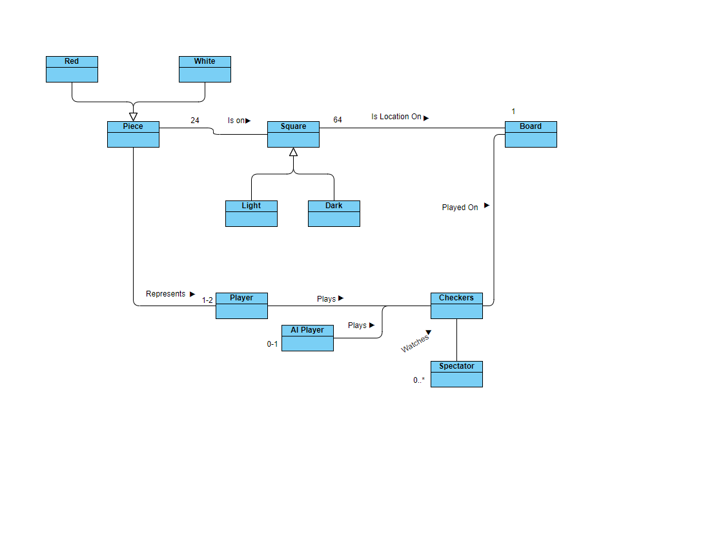
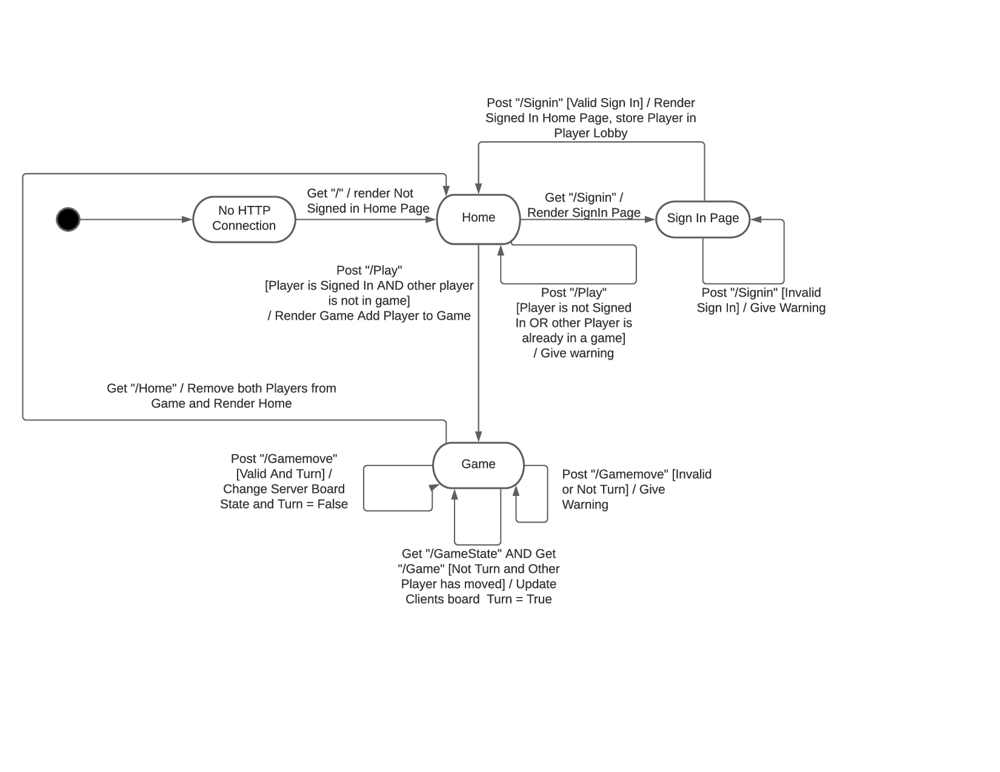
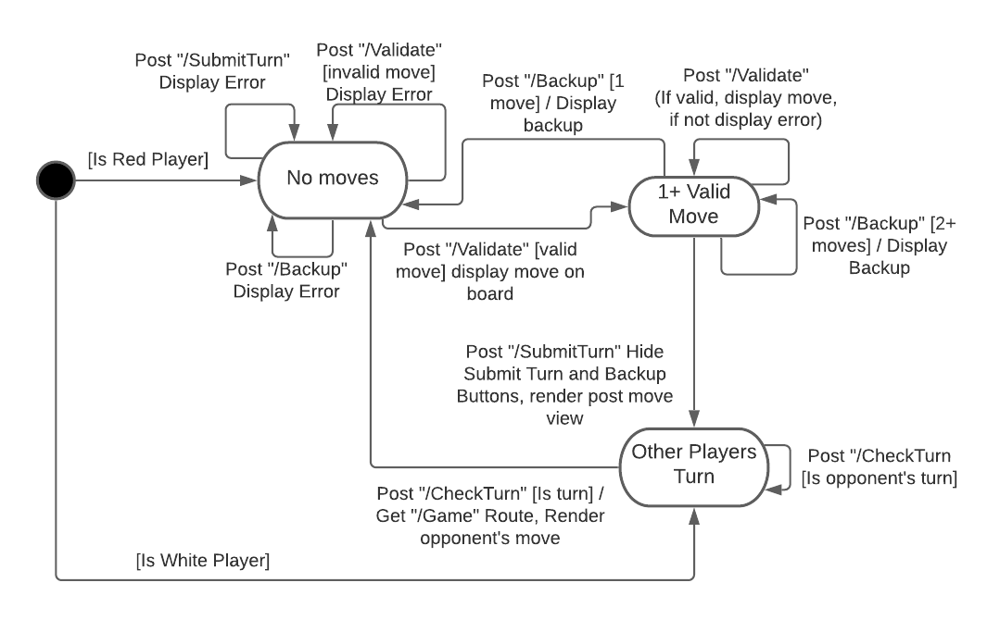
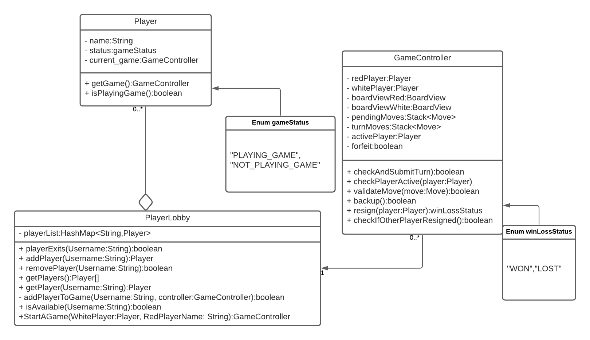
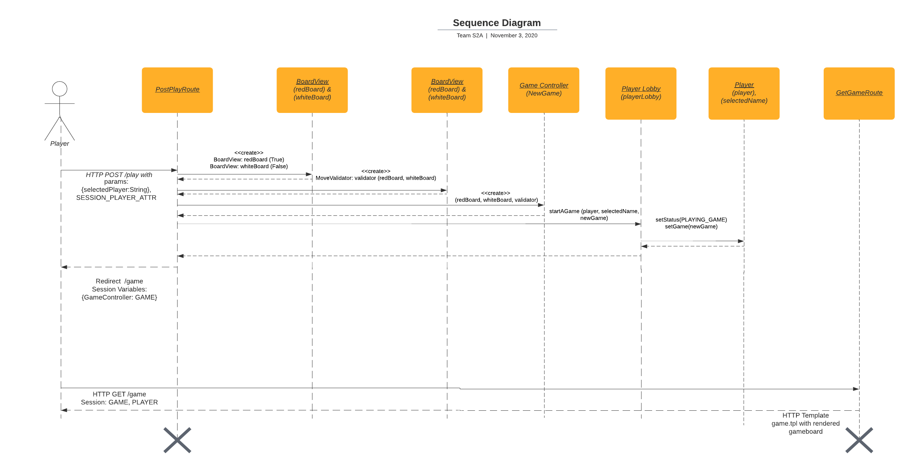

# PROJECT Design Documentation

## Team Information
* Team name: Team Effort
* Team members
  * Gerrit Krot
  * Payton Burak
  * John Davidson
  * Evan Ruttenberg
  * Michael Canning

## Executive Summary

WebCheckers allows users to connect to and play a game of checkers with other users using a web application. The user interface allows users to login using a unique username, and then pick from a list of other players to start a checkers game.

Users can play a game with one other player, and can play a single game at a time. Once in a game, players can drag their own checkers around the board to valid positions during their turn. The WebCheckers software will keep track of moves and turns, as well as win and loss conditions. Players can also choose to forfeit games that they want to end early.

This version of WebCheckers will have 2 enhancements, an AI player and spectator mode. The AI player enhancement allows users to play against a computer player which allows for users to play a game of checkers even when no other players are available to play with. The spectator mode allows for players to watch other players that are currently playing a game, without actually playing in that game themselves.

### Purpose
The purpose of this project is to create an online Web Checkers application that will allow players to remotely play a game of checkers against each other using the American Rules.

### Glossary and Acronyms
> _Provide a table of terms and acronyms._

| Term | Definition |
|------|------------|
| VO | Value Object |
| AI | Artificial Intelligence |
| SP | Space        |
| CP | Color        |

## Requirements

Features implemented in the application include the ability for players to play a synchronous checkers game against 
another seamlessly. Simply by signing into the web application, players can automatically see all of the other players 
who are online. They cannot, however, start a game against a player who is already in a game. Players can also choose 
to sign out of the website or forfeit from the match at any time.

### Definition of MVP
WebCheckers allows for players to sign in to a lobby and choose another signed-in player to play checkers against.
 Each player alternate turns moving and capturing pieces until someone wins. Either player can resign from a game at 
 any time.

### MVP Features
- Player Sign-in
- Start a Game
- Player Sign-out
- Forfeit
- Change Turns
- Game Movement 
- Win / Loss
- Leave the Game

### Roadmap of Enhancements
- AI Player

## Application Domain

Starting from the Player object and stepping through the domain model, a Player object represents a user that is using 
the WebCheckers system. A player plays a single game of checkers at once. A game of checkers can have 1-2 players, and 
0 or 1 AI player(s).

A Checkers game can also have 0 to an infinite number of spectators.

A game of checkers is played on a single Board. A board has 8 row objects. Each row has 8 Space objects. These spaces 
represent board locations. Spaces can be either “black” or “white”, and have 0 or 1 Pieces on them.

Piece objects are also a part of a game. There are 0 - 24 pieces in a game, and they go on top of Space objects.
Pieces can either be Red or White, which is an attribute of the Piece object. Pieces represent a Player object in a 
game, with all pieces of one color being for one player, and the other color being for the other player.

## Architecture and Design

This section describes the application architecture.

### Summary

The following Tiers/Layers model shows a high-level view of the webapp's architecture.

As a web application, the user interacts with the system using a browser. The client-side of the UI is composed of HTML 
pages with some minimal CSS for styling the page.  There is also some JavaScript that has been provided to the team by 
the architect.

The server-side tiers include the UI Tier composed of UI Controllers, and Views. Controllers are built using the Spark 
framework and Views are built using the FreeMarker framework.

Details of the components within these tiers are supplied below.

### User Interface Tier

This section describes the web interface flow; this is how the user views and interacts
with the WebCheckers application.

A player connects to the WebCheckers server via HTTP.

When a player first visits the site they are not signed in, so they are shown the "not signed in" version of the home 
page, which only shows a user count. Once on the home page a user can check to sign in.

If a player clicks "Sign In" they are taken to the sign in page "/signin". If the player is already signed in, when they
go to this page they will be taken back to the home page. Otherwise, a player will enter their name and click 
"Sign In". If the player enters an invalid username, a message is shown indicating the error. Otherwise, they are 
taken back to the home screen, and shown the signed in version of the home page now, which includes a list of players 
they can select from the start a game with.

From the player list on the home screen they can select a player to play with. If there are no available users, they 
are shown a message indicating there are no players online in place of the user list.

Once they select a player and press "Start a Game" if the player is unavailable, they are shown an error message, 
otherwise they are taken to the game. If another player starts a game with them while they are in the lobby, they will 
be automatically taken to the game with that player.

If a player chooses to play against an AI, they initiate a game with the computer. Players can choose between the Easy
or Hard AI.

Once in a game they can move pieces if it is the player's turn, otherwise pieces cannot be moved. Players can see moves
made by the other player only after they have finished their turn. Once a game is over, a player is taken back to the 
home page and shown the list of players again, so they can start a new game.

If a player wants, they can sign out at any time by clicking the "Sign Out" button, in which case they will be taken 
back to the homepage in a signed out state.

### Application Tier
PlayerLobby holds a map of the players currently logged-in. Players can log into the lobby with their own unique 
usernames and can log out at any time, meaning they’ll be removed from the lobby map. PlayerLobby presents a list of 
the current players in the lobby to each respective logged-in player. Logged-in players can choose from this list and, 
with PlayerLobby asserting that the chosen player is not currently in a game, the PlayerLobby will commence a game 
between the two players.

The GameController determines which player’s turn it is and acts as the interface between the two players, updating 
each players’ view of the board. This is done to promote the single responsibility aspect of OO design. By using a
rudimentary controller-style class, we are able to encapsulate all of the model tier from the rest of the program.
Each player takes turns moving pieces and making captures, which updates that respective player’s board. Once a player 
has finished, GameController checks to see if all moves made were valid. Assuming moves were valid and submitted, 
GameController passes the turn over to the other player. GameController always checks to see if either player has 
resigned from the game. If a player resigns, GameController ends the game.

The Games class contains the current set of games being played. When a game is started it is added to a list of current
games; when it ends it is removed from the list. The list can be grabbed as a whole or it game be searched for a
specific game ID. This is mainly used for returning a list of current games for the spectator feature.

The EasyAI performs random moves based on the boardstate. Whenever a player challenges one, a new instance is created
to play against, which is removed once the game is done.

The HardAI performs moves based on the following algorithm.

### Model Tier
The Model Tier for this application handles all of the logic of the Checkers Game. When a Checkers Game is started, 
two BoardViews are created to represent the board in the manner that each player would see it: one for the Red player 
and one for the White player. The BoardView consists of 8 Rows, each row containing 8 Spaces. These Spaces represent 
the individual squares on a Checkerboard. Each space has a unique position consisting of 2 integers (0-7) which 
represents their position on the board. Each space is either black or white and may contain a piece on it. Each 
piece is either Red or White, depending on the controlling player, and can be either a normal piece or a king. The 
normal pieces are only allowed to move towards the opposite side of the board, while the kings can move in any 
direction. To turn a piece into a king, a player must first move it to the opposite side of the board.

Whenever a move is made, the MoveValidator class validates that move. A move is deemed valid based on the American 
Checkers Rules. After a player has completed a turn consisting of either a single move or a complete chain of jumps 
from a checkers piece, they can use the submit turn button to end their turn. At this point in time, it will become 
the opposing players turn and they will get to see the board updated with the move that the other player made.

Rankings are handled by the ELORank class. This class is a model of the ELORanking system used to compare players based
on their past performance. Each player owns an ELORank object which contains their game history and also
functionality for calculating their overall rank using the ELO formula.

### Design Improvements
We made many different design improvements over the course of sprint 3. Firstly, we broke up our BoardView class into a
MoveValidator class, which now validates all moves and retains the data for that turn. This improved our Single
Responsibility. We also increased our dependency injection by moving the initialization of the Boards to outside the 
Game Controller. We tried to simplify a few of our classes by moving our enums outside of the classes. We kept them as
Enums to increase the readability of our program: the Enum is easy to read, whereas a boolean would not be. We also 
could have made the piece class a subclass of a superclass, we decided not to, but if in the future we needed to add a 
different kind of piece class, we would need to create a superclass. Because we know the scope of the project, we
believed that it would only increase cohesion. We also added inheritance to our project in the form of AIPlayer, 
AIMoveValidator, EasyAI and HardAI. Our player is currently an example of OPEN/CLOSE implementation, since we were 
able to extend it to act as an AI, while still allowing it to work as a player. I wish that we could have turned it 
into an interface, but we did not end up doing this due to a lack of time. The AIPlayer functions like a player, but
is manually updated whenever a player submits a turn, and performs its turn logic via a function that it calls. Both the
EasyAI and the HardAI use the same general turn structure, but differ on which move it selects for the turn, so the
abstract AIPlayer allows for the them to use their own logic. We are also proud of the fact that all of our logic and 
board setups could be swapped out seamlessly for chess logic and pieces (if they were to be implemented) in both the
game controller and AIPlayer. Overall, we took the feedback from Sprint 2 into heavy consideration, and implemented a
lot of changes to the program to improve the design.

## Testing

### Acceptance Testing
All of our acceptance testing for this sprint was completed as expected with the exception of one in the “Jump” user 
story.

The acceptance tests from previous branches still are passing and were not broken by any changes during this spring. 
All of this is confirmed both through manual testing, and unit testing.

### Unit Testing and Code Coverage
Unit tests were implemented for numerous classes in each tier of the project architecture. The strategy for 
unit tests was to test each possible output of given methods, whether that be a boolean or object-based output. 
The coverage of the tested code was extremely high, and for most classes the coverage was well over ninety percent. 
The team’s code coverage target was ninety percent, and for all classes except one that have currently been tested, 
this coverage target has been reached. The class that has not been sufficiently tested is the GameController class, 
which has taken on too many roles, so as the class is refactored, more of the respective code will be covered in the 
unit testing process.

### Metrics
This section will be filled out later